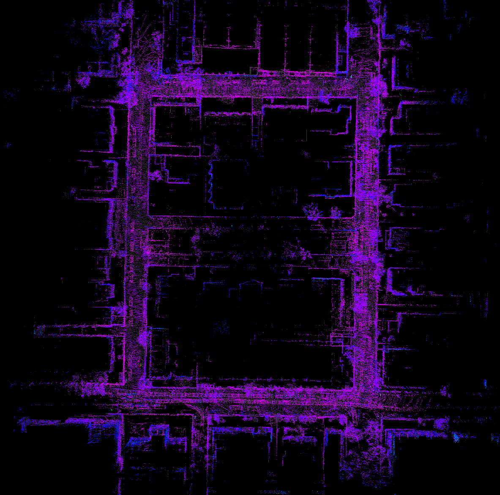
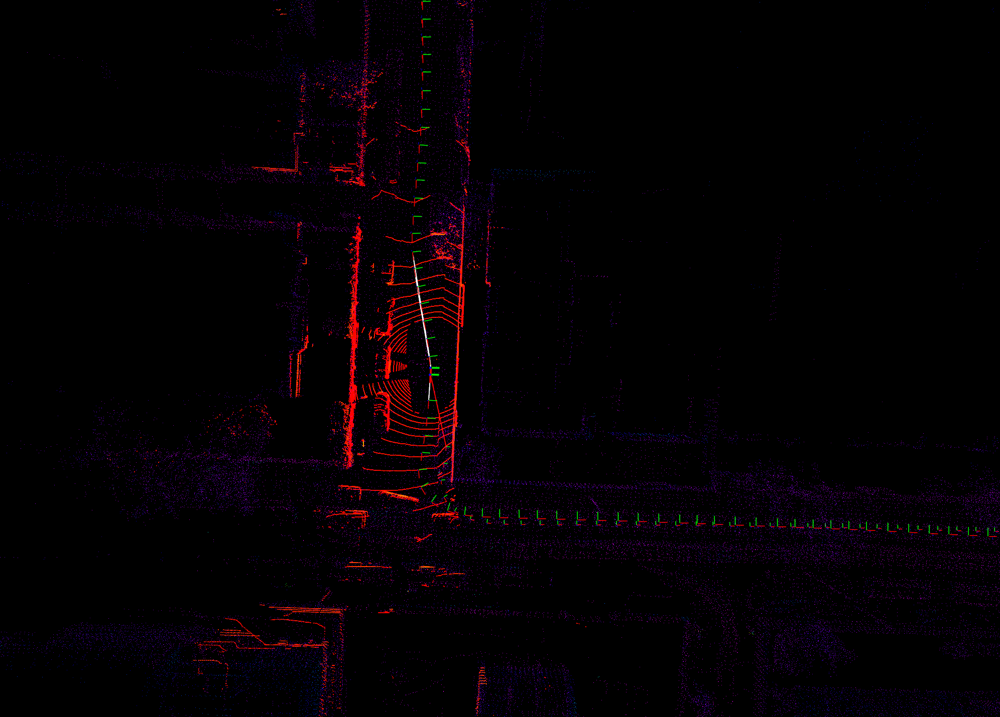
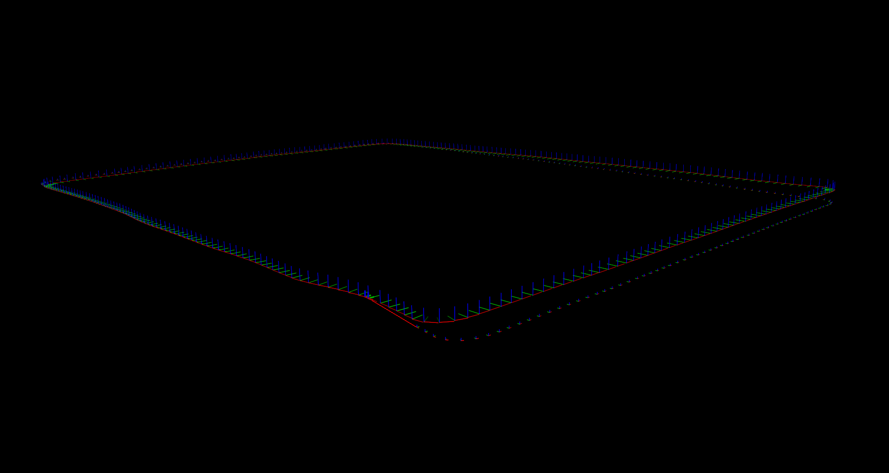
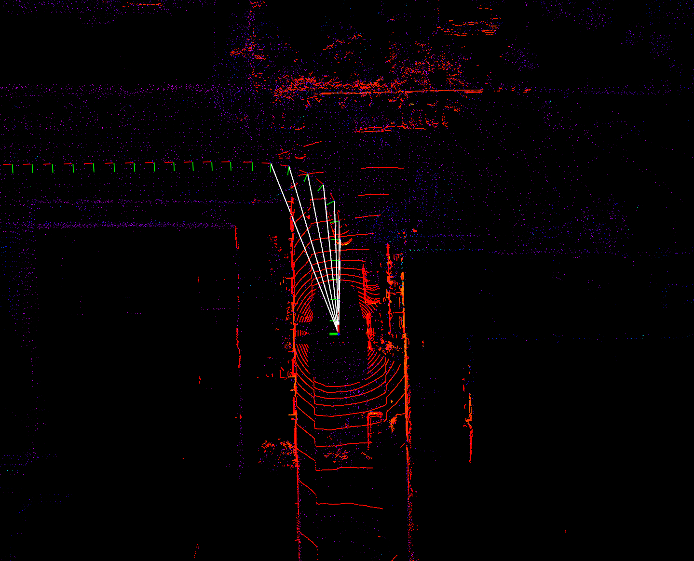

# DLIOM

---

**这份代码是基于[direct_lidar_inertial_odometry](https://github.com/vectr-ucla/direct_lidar_inertial_odometry)**，对论文[Direct LiDAR-Inertial Odometry and Mapping: Perceptive and Connective SLAM](https://arxiv.org/abs/2305.01843)的早期复现改进版本。

**代码功能正在持续完善中，当前仍然存在较多bug，仍在努力测试修改**

<p align="center">
  
  
  <br>
  <em>图1 : UrbanLoco dataset Dataset 5: HK-Data20190117测试效果</em>
</p>

<p align="center">
  
  <br>
  <em>图2: 闭环前后的轨迹对比</em>
</p>

<p align="center">
  
  <br>
  <em>图3: 基于3D Jaccard的submap构建</em>
</p>

### 依赖

- Ubuntu 20.04
- ROS Noetic (`roscpp`, `std_msgs`, `sensor_msgs`, `geometry_msgs`, `nav_msgs`, `pcl_ros`)
- C++ 14
- CMake >= `3.12.4`
- OpenMP >= `4.5`
- Point Cloud Library >= `1.10.0`
- Eigen >= `3.3.7`
- GTSAM >= 4.0.2


```sh
sudo apt install libomp-dev libpcl-dev libeigen3-dev
```

### 编译

```sh
mkdir ws && cd ws && mkdir src && cd src
git clone https://github.com/YWL0720/DLIOM.git
cd ..
catkin_make
```

### 已经实现的功能

- 基于GTSAM的后端
- 基于3D Jaccard的子地图构建
- 基于欧氏距离的回环检测


### 待实现的功能

- 重力因子
- 


---


### 更新日志:

- 7.11 单独线程用于更新地图，解决回环后崩溃的问题
- 7.12 更改了一些用于回环的参数
- 7.13 修正了ulhk数据集重力的影响
- 7.13 完成了回环后位姿在submap中的更新
- 7.13 更新了readme
- 7.14 更新了gtsam::pose3的旋转构造方式 此前的转换存在问题
- 7.14 添加了对newer college数据集的测试 增加了保存回环后关键帧位姿的接口
- 7.17 增加了utbm接口
- 7.18 修正了fitness的bug
- 8.1 增加GeographicLib的GPS预处理接口
- 8.2 完成GPS回调 UTM与Lidar系的初始化对齐 

### TODO:
- 重新制定submap构建时关键帧位姿的确定方式
- 测试闭环后系统的稳定性
- 加速相关操作
- 闭环的策略问题
- GPS因子
- 闭环地图更新速度

---

### 参考

```
@misc{chen2023direct,
      title={Direct LiDAR-Inertial Odometry and Mapping: Perceptive and Connective SLAM}, 
      author={Kenny Chen and Ryan Nemiroff and Brett T. Lopez},
      year={2023},
      eprint={2305.01843},
      archivePrefix={arXiv},
      primaryClass={cs.RO}
}
```

```
@article{chen2022dlio,
  title={Direct LiDAR-Inertial Odometry: Lightweight LIO with Continuous-Time Motion Correction},
  author={Chen, Kenny and Nemiroff, Ryan and Lopez, Brett T},
  journal={2023 IEEE International Conference on Robotics and Automation (ICRA)},
  year={2023},
  pages={3983-3989},
  doi={10.1109/ICRA48891.2023.10160508}
}
```


